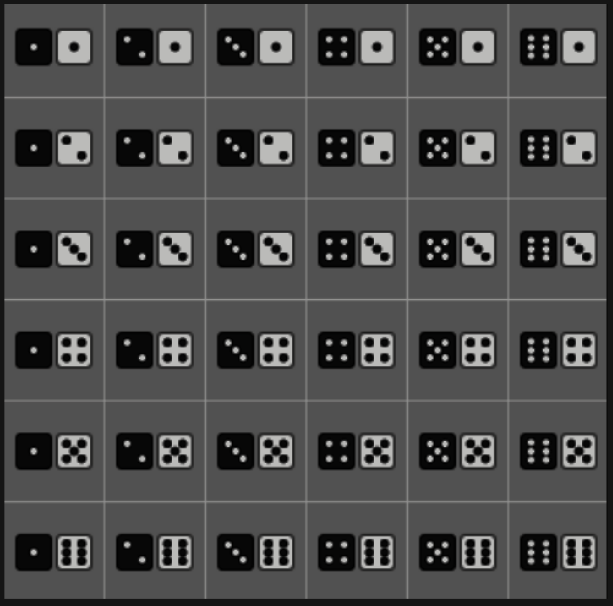

Material is lessons from Khan Academy, to refresh my memory and skills.

```{r setup, include=FALSE}
if (requireNamespace("thematic")) 
  thematic::thematic_rmd(font = "auto")
```

```{r, warning=FALSE, message=FALSE ,echo=FALSE}
library(tidyverse)
library(stats)
library(glue)
library(arrangements)
library(bayesrules)
library(bayestestR)
```


## Basic Theoretical Probability

Flipping a coin has 50% probability of Heads, P(H) = 1/2

```{r}
# dice rolling a 1 on 6 sided die = f/n 
prob = function(f, n){
  p = f/n
  glue('Probability is {round(p, 2)*100}%')
}

prob(2,6) # probability of rolling a 1 or 6
prob(3,6) # probability of rolling an even

```

### Sample space

Find the probability of pulling a yellow marble from a bag with 3 yellow,
2 red, 2 green and 1 blue
```{r}
possible_outcomes = c(
  rep('Y', times=3),
  rep('R', times=2),
  rep('G', times=2),
  rep('B',1)
)

n = length(possible_outcomes)

prob(3, n)
```

Bag of marbles: 9 red, 2 blue, 3 green in it. What is the probability of selecting
a non-blue marble?

```{r}
bag = c( 
  rep('R', times=9, each=1),
  rep('B', times=2, each=1),
  rep('G', times= 3)
)

n = length(bag)
# non blue marble 14-2
prob(12, n)

```

A number is randomly chosen, what is the probability 
that number is a multiple of 5?

```{r}
nums = c(32,49,55,30,56,28,50,40,40,45,3,25)

n = length(nums)

# divide the vector by 5, use modulus to get only the ones with 0
f = sum(nums%%5 == 0)

prob(f,n)
```

Monty Hall Problem

behind 3 doors are prizes, 2 are goats and 1 is cash prize

```{r}
doors = 3

# probability of winning NOT switching door
win_noSwitch = 1/doors
lose_noSwitch = 2/doors

# switch door, probability of picking wrong door is 2/3
win_switch = 2/doors
lose_switch = 1/doors

```


Probability of flipping Heads on 3 coins
```{r}
coin = tribble(
  ~'flip 1',~'flip 2',~'flip 3',
  'T','T','T',
  'T','T','H',
  'T','H','T',
  'T','H','H', #
  'H','T','T',
  'H','T','H', #
  'H','H','T', #
  'H','H','H'
)

n = nrow(coin)

# exactly 2 H
f = 3

prob(f, n)

```


# Sets

x = { }

- `union(x,y)` joins all elements  "OR" `U`
- `intersect(x,y)` elements in both sets  "AND"  
- `setdiff(x,y)` x - y, elements !y but are in x `x\y`
- `setequal(x,y)`
- c %in% y  tests for membership
- `choose(n,k)` k= number of subsets from set size n

```{r}
x = c(6,12,18,24    )
y = c(12,18 )


sort(union(x,y) )
setdiff(x,y) # x\y
intersect(x,y)
```


# Conditional Probability

BAYES THEOREM = P(A|B) = P(B|A) * P(A) / P(B)

Probability of event A is 0.6, probability of event B is 0.5, probability
of A given B is 0.7. Find P(B | A).

P(A and B) = P(A | B) * P(B) = P(B|A) * P(A)

```{r}
A_given_B = 0.7
B = 0.5
A = 0.6

A_and_B = A_given_B * B

glue("P(A and B) = {A_and_B}")

# A * P(B | A) = 0.35
B_given_A = A_and_B / A
glue("P(B given A) = {round(B_given_A,2)}")
```
```{r}
A = 0.55
B = 0.18
AandB = 0.05

BgivenA = AandB/A 
glue("P(B|A) = {round(BgivenA,4)}")

A_given_B = AandB/B
glue("P(A|B) = {round(A_given_B,4)}")
```




```{r}
# dice rolling a 1 on 6 sided die = f/n 
# rolling 2 dice = 36 total outcomes
prob2 = function(f, n){
  p = f/n
  glue('Probability is {round(p, 4)*100}%')
}
prob2(1,6) # rolling a 5
prob2(1,6) # rolling a 3
prob2(1,36) # rolling a 5 and a 3 on 2nd die

# P(B|A)= P(AandB) / P(A)  
# _6_ outcomes have 5 as 1st die, _1_ square has 3 as 2nd die = 1/36
AandB = (1/36) 
A = (1/6)
B = 1/6
BgivenA= AandB / A
glue("P(B|A) = {round(BgivenA,4)}")

# check for independence P(B|A) == P(B) 
glue("indep. events = {BgivenA == B}")
```

```{r}
# cards
s = c('9','5','6','2','4','7')

odds = 3      # 3 odd numbered cards
AgivenB = 1/3 # select odd and spades
A = 2/6       # selecting spade
BgivenA = 3/6 # 2 cards spade, 1 is odd
B = odds/6    # select odd numbered cars
AandB = A * B

glue("P(A) == P(A|B) = {A == AgivenB }")
glue("P(B) == P(B|A) = {B == BgivenA }")
glue("P(B|A) = {round(BgivenA,4)}")
glue("P(A|B) = {round(AgivenB,4)}")
glue("P(AandB) = {round(AandB,4)}")
glue("indep. events = {BgivenA == B}")
```


# Factorial, Permutations & Combinations


```{r}
# --- combinations
# 5 movies 8 restaurants 2 sports, number of dates = 5*8*2
# continent = 4  cities = 10*8*4*3
# shirts = 10*4*12*9
# schools = 6*3*2

# -- permutations nPr
# 3 letters for 3 letter word, no repeat = 5*4*3
# 15 ingredients for 3 dishes  n=15, r=3
# 6 questions = factorial(6)
# arrange 4 dishes from 7 dishes = 7*6*5*4
# 1200 students, 40 govt members, 4 positions  n=40 r=40
# select 4 from 6  = 6*5*4*3
# 6 albums= 75 songs => 10 songs from 75 (no repeats)  r=10 n=75
# arrange 3 runners out of 7 =  7*6*5
# 5 pets, 16 from 75 take 1   r=16 n=5

# --- combinations nCr = n! / (n-r)! * r!

# 3 dishes from 9 options = 9C3
# 2 toppings from 6 options = 6C2
# select 5 from 7 workers = 7C5
# select 3 from 6 books = 6C3
# factorial(6) / (factorial(6-3) * factorial(3))


# ----- Permutations & Combinations

# 5 deer, 2 next to each other  factorial(5)
# factorial(4)*2 # 2 deer
# 6 letter word, 2 letters repeat  = factorial(6)/factorial(2)

# 
```


1:100, how many are divided by 3 or 2 ?

33 numbers /3 and 50 numbers /2 = 50+33 = 83
drop duplicates like 6 (/3 and /2)
16 numbers are both /2 and /3
83-16 = 67


