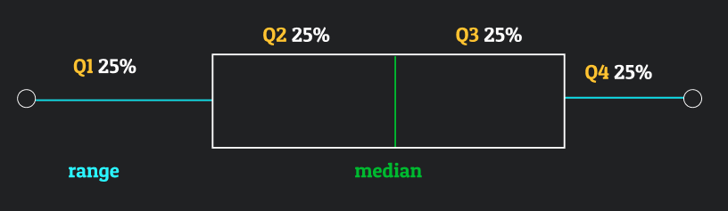
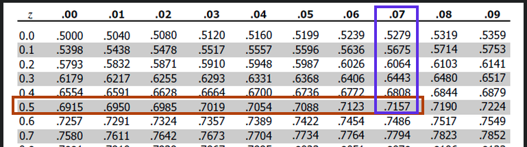

Material is lessons from Khan Academy, to refresh my memory and skills.

```{r setup, include=FALSE}
if (requireNamespace("thematic")) 
  thematic::thematic_rmd(font = "auto")
```

```{r, warning=FALSE, message=FALSE ,echo=FALSE}
library(tidyverse)
library(stats)
library(ggvenn)
```


## Frequency Tables & Venn diagrams

```{r}
# library(ggvenn)

circles = list('Bajor' = c(6,3), 'Cardassia' = c(1,3))

ggvenn(circles, set_name_color = 'white', 
       show_elements = T,
       text_color = 'white')
```

- 6 people are Bajoran and not Cardassian 
- 3 people are both Bajoran and Cardassian
- 1 person is Cardassian and not Bajoran


```{r echo=FALSE}
tribble(
  ~' ',~'Bajoran', ~'Cardassian',~'total',
  'Cardassian', 3, 6, 9,
  'Bajoran', 1, 2, 3,
  'total', 4, 8, 12
)

```


## Two way frequency table

| .                | Type A          | Type B           | total |     |
| :--------------- | :-------------- | :--------------- | :---- | :-- |
| Pos X            | 28              | 35               | 60    |     |
| Neg X            | 97              | 104              | 201   |     |
| ---- total ----  | = 125           | = 139            |       |     |
| Proportion Pos X | 28 / 125 = 0.22 | 35 / 139 = 0.25  |       |     |
| Proportion Neg X | 97 / 125 = 0.78 | 104 / 139 = 0.75 |       |     |   


# Descriptive Stats

Average = mean. Median = middle. Mode = most common number

```{r}
a = c(1,2,4,6,4)

sort(a)

total = sum(a)
n = length(a)

# avg = total/n
paste("the avg ", mean(a))

paste("the middle", median(a))

# mode(a)
```


```{r}
x = c(0,2,4,12,12,5,6,19)
mean(x)

v = c(80,90,92,94,96)
v2 = c(90,92,94,96)

paste(" mean with lowest value: ",mean(v))
paste(" mean without lowest value: ",mean(v2))
```

athlete pulls avg to the right but median will be < mean

3 people make same money 50+50+50/3 =50  median = 50

3 unemployed pull avg left but median will be > mean

x points, remove 1 lowest value , the median move to the right, mean goes up


```{}
dots
  1   2  3  1  2     1
|-|-|-|--|--|--|--|--|-|-
6 7 8 9 10 11 12 13  14  distribution
```


## IQR 

Interquartile range is the amount of spread in the middle %50 percent of a dataset. 


```{r}
x = c(16,24,26,26,26,27,28)
# median       ^

median(x)
# mean(x)
# max(x)
# min(x) 
range = max(x) - min(x)

# break into quartiles Q1 (25%)
x1 = c(16,24,26)
q1 = median(x1)

# Quartile 3 (75%)
x3 = c(26,27,28)
q3 = median(x3)

IQR = q3 - q1
IQR
```

## Range, Variance & STD

Range (max - min) is the measure of dispersion, how far away from the mean (average) a data point is.

Variance $\sigma^2$  

Standard Deviation $\sigma$ (the sqrt( variance))

```{r}
p1 = c(-10,0,10,20,30)
p2 = c(8,9,10,11,12)

# mean(p1) #= 10
# mean(p2) #= 10

# return the max and min for vector
range1 = range(p1)
# subtract the range elements to get range
range1 = range1[2]- range1[1] #= 40

range2 = range(p2)
range2 = range2[2] - range2[1] #= 4

# variance for p1 vector, (elements - mean)^2
v1 = (-10 - 10)^2 + (0-10)^2 + (10-10)^2 +(20-10)^2 +(30-10)^2
variance1 = v1 / length(p1)

# variance for p2 vector
v2 = (p2[1] - 10)^2 + (p2[2]-10)^2 + (p2[3]-10)^2 +(p2[4]-10)^2 +(p2[5]-10)^2
variance2 = v2 / length(p2)


# standard deviation, sqrt( variance )

std1 = sqrt(variance1)
std2 = sqrt(variance2)
```


## Population mean & variance

Population mean $\mu$ and variance $\sigma^2$ measures the dispersion

```{r}
# vector of population
pop = c( 8,1,2,6,1,4)

mean(pop)
# length(pop)
median(pop)

# population mean
pop_mean = mean(pop)

# variance
variance = function(v, pop_mean){
  v2 = (v[1] - pop_mean)^2 + 
    (v[2]-pop_mean)^2 + 
    (v[3]-pop_mean)^2 +
    (v[4]-pop_mean)^2 + 
    (v[5]-pop_mean)^2 +
    (v[6]-pop_mean)^2
  
  variance2 = v2 / length(v)
  print(variance2)
}

# variance(pop, pop_mean)

# standard deviation
print( sqrt( variance(pop, pop_mean) ) )

sd(pop)
```

```{r}
c = c( 13,2,1, 5,2,7 )

length(c)
m = mean(c)
m
median(c)
range(c)

# ----- IQR
c1 = c(13,2,1)
cm1 = median(c1)
c2 = c(5,2,7)
cm2 = median(c2)

glue::glue('IQR: ',cm2 - cm1)


variance = function(v, pop_mean){
  v2 = (v[1] - pop_mean)^2 + 
    (v[2]-pop_mean)^2 + 
    (v[3]-pop_mean)^2 +
    (v[4]-pop_mean)^2 + 
    (v[5]-pop_mean)^2 + 
    (v[6]-pop_mean)^2 
    # (v[7]-pop_mean)^2 + 
    # (v[8]-pop_mean)^2 + 
    # (v[9]-pop_mean)^2
  
  variance2 = v2 / length(v)
  print(variance2)
}

variance(c, m)

# std
sqrt( variance(c, m) )
```
the mean is skewed due to the 250 datapoint so the **median is better for central tendency** 


## Sample variance 

Sample mean $x^-$ and sample variance $S^2_{n-1}$ . 
Standard deviation measures the spread of a data distribution. It measures the typical distance between each data point and the mean.

```{r}
s = c(13,2,1,5,2,7)
                              
n = length(s)
n

# sort(s)

# sample mean
sm = mean(s)
paste('mean: ',sm)

# median
median(s)

# ------ IQR
# sq1 = c(2.6, 3.0, 4.9, 5.0, 5.0)
# sm1 =median(sq1)
# sq2 = c(6.0, 6.0, 7.9, 8.0 ,8.2)
# sm2 = median(sq2)
# 
# sm2 - sm1

# IQR(s) gives off values

# sample variance (unbiased)// only 5 number //   var(s) gives off values
variance(s, sm )

# for >5 numbers
s_2 = (s[1]- sm)^2 + 
  (s[2] - sm)^2 + 
  (s[3] - sm)^2 +
  (s[4]- sm)^2 +
  (s[5]- sm)^2 +
  (s[6] - sm)^2

s_2
# population variance
paste('pop var: ', s_2 / (n -1))

# sample variance
paste('sample var: ', s_2 / n )

# sample std (biased)  sd(x) gives off values
sqrt(variance(s, sm ))
```


## Box & Whisker Boxplot 

spread of data points.

- whiskers are range
- middle box line is median
- outside box lines are quartiles median

Outliers 

- find the median
- use the medians of q1 and q3 




```{r}
b = c(52,54,56,58 )
b = c(10,52,54,56,58 )


paste('mean = ', mean(b) )
paste('median = ', median(b) )# q2


q1 = c( 4 , 4 , 6,  7 )
paste('Q1 ',median(q1))

q3 = c(  11 ,12 ,14 ,15  )
paste('Q3 ',median(q3))

iqr = median(q3) - median(q1)
paste(' IQR = ',iqr)

# outliers will be < q1 - 1.5 * IQR  or q3 + 1.5 * IQR
outlier_1 = median(q1) - 1.5 * iqr
paste('outlier is <= ', outlier_1)  

outlier_2 = median(q3) + 1.5 * iqr
paste('outlier is >= ', outlier_2)

# ------------
# 3 6 12 13 39 = 2 <- high  0  <- low
# 13 31 38 42 62 = 1
# 4 9 10 13 20 = 0
# 13 24 30 40 138 = 0
# 1 2 3 5 9 = 0

q1 = 13 
q3 = 6
i= q3 -q1

q1 - 1.5 * i
q3 + 1.5 * i
```


<!-- ``` -->
<!-- Min   Q1    Median    Q3     Max -->
<!-- -------------------------------- -->
<!-- 12    18    23        26    29 -->
<!-- 50    56    64        70    76 -->
<!-- 7     9     12        15    18 -->
<!-- ``` -->
<!-- - 75% of data is more than what number? = look at 25% (Q1)  -->
<!-- - what % is fewer than 56 ? -->
<!-- - 25% have more than __ ? -->
<!-- - 75% have fewer than __ ? -->


## Mean Absolute Deviation (MAD)

the absolute deviation data point from the mean

```{r}
m = c(0.3,0.6,0.5,1,0.4,0.8 )

mean(m)
# n = c(4,5,6,1)
# mean(n)

# paste('MAD = ', stats::mad(m) )

w =c(
  abs( mean(m) - m[1] ),
  abs( mean(m) - m[2] )  ,
  abs( mean(m) - m[3] ) ,
  abs( mean(m) - m[4] ) ,
  abs( mean(m) - m[5] ),
  abs( mean(m) - m[6] )
)

paste('MAD : ',sum(w)/ length(m) )
```


# Percentiles 

the % of the data that is below the amount in question or % of the data at or below the amount

```{r}
# number of 14 drivers in total
# what percentile rank for driver with driving time of 6 hrs?
# h = c(1,2,2,3,4,5,5) # below 6  7 numbers/ 14 = 50%
# h.1 = c(1,2,2,3,4,5,5,6) # at 6  8/14 = 57%

# cumulative relative frequency 
sugar = tibble(
  sugar_content = c(5, 10, 20, 30, 40, 50),
  cum_rel_freq = c(0.1,0.2,0.4,0.6,0.8,1.0)
)
ggplot(
  sugar,
  aes(x= sugar_content, y= cum_rel_freq)
)+
  geom_line()+
  geom_point()
```


15 grams of sugar would be ~ 20% of drinks

what is the median are in what grams ?  0.5 = ~ 25 grams

what is the IQR of drinks? 
- 25th = 18 g
- 75th = 40 g
- 40 - 18 = 22 grams


# Z-Scores 

measures how many standard deviations away from the mean 

- z = $x$ - $\mu$ / $\sigma$
- positive z-score = above average
- negative z-score = below average
- 0 z-score = close to average
- *unusual* if z-score is < 3 or > 3

```{r}
# mean
mean = 76
std = 3.0

# data point
data_point = 71

# positive & negative points on plot
z_pos = mean + std
z_neg = mean - std 

z_score = (data_point - mean) / std

paste('z score: ', round(z_score,2), 'std from the mean')

```


shifting data: you add 5 to each data column or multiply by 5 the
mean, median don't change but IQR and std scale with the data.


# Density Curves

```{r}
water = c(0.5,0.7,2.1,2.2,2.9,3.2,3.2,3.3,3.7,4.5,4.6,4.8,5.2,5.3,6.7,8.1)

df = tibble(
  water = water,
  count = frequency(water)
)

ggplot(
  df,
  aes(x= water)
) +
  geom_density()
```


need an interval for getting a approximate value
>= 2.9 + <= 3.1 is ~ 0.04%


right skewed (bump on left) = median is left to mean

left skewed (bump on right) = median is right to mean


density curve, % of area under density curve x > 3


# Normal Distribution

```{r}
mean = 150
std = 20
data_point = 161.4

z_pos = mean + std
z_neg = mean - std 

# what proportion is lower than data point?
z_score = (data_point - mean) / std

paste('z score: ', round(z_score,2), 'std from the mean')

# look at z-table using our z-score

# the z value is 0.7157

```



If the data is normally distributed, then 71.5% of the values would be below 0.57. The proportion is 0.7157.

## school test example

```{r}
mean = 40
std = 3
data_point = 47.5

z_pos = mean + std
z_neg = mean - std 

# what proportion is lower than data point?
z_score = (data_point - mean) / std

paste('z score: ', round(z_score,2), 'std from the mean')

# proportion LESS than data point
z_table = 0.9938 

# proportion that scores MORE than data point
paste('proportion higher than data point: ', round(1 - z_table, 4) )
```

## prices between range example

example data points prices between 624 - 768, check each min and max then find the z-table value for the z-score

```{r}
mean = 70
std = 5

# -- data points 
data_point_1 = 68
data_point_2 = 73

# what proportion is lower than data point?
z_1score = (data_point_1 - mean) / std
z_2score = (data_point_2 - mean) / std
glue::glue('z_1 score: {data_point_1} : {round(z_1score,4)} std from the mean')
glue::glue('z_2 score: {data_point_2} : {round(z_2score,4)} std from the mean')

#---- look at Z TABLE -----
# proportion LESS than data point
# z_table = 0.10565


# >>>>>>>>>>>>>>>>>
# proportion that scores MORE than data point
paste('proportion higher than data point: ', round(1 - z_table, 4) )

# -----------
# proportion of prices between range 

# z score for data point 1 = -0.4 -->> look at z-table
z_1 = 0.3445

# z score for data point 2 = 0.6
z_2 = 0.7257
glue::glue(' proportion between range: {(z_2 - z_1)*100}%')
# glue::glue(' proportion between range :: {(z_1 - z_2)*100}%')
```


## z-table reverse example

```{r}
mean = 85
std = 29

# z_pos = mean + std
# z_neg = mean - std

#>>>>>>>>>>> no data point given
# use z table in reverse, use x % to find z-score

#  EX.: looking for scores < 25%
#  read z-table from INSIDE TABLE then outward, 
#  find closest value  == 0.24825
# >>>>>>>>>>>>

#  x% =  left of 5% == 0.05  closest {0.4947}
z_score = -1.65

# rate = mean + z_score * std
# rate
# 
# paste('rate for (%): ', ceiling(rate))
```


## Empiracal rule

rule **68-95-99.9**

- 68% of data is within 1 std of the mean
- 95% of data is within 2 std of the mean
- 99.9% of data is within 3 std of the mean

```{r}
mean = 9.5
std = 11

z_pos = mean + std
z_neg = mean - std
glue::glue('| z {z_neg} --- z +{z_pos} |')

#>>>> no data point given
# rates in the top 30%, so need to 100-10= 90% of data range
# use z table in reverse, use % to find z-score
# find % 0.9015 == 1.29 z-score
# z_score = 1.29

# within 10% 
z_score = -1.29

# mean + 0.53 * 9
rate = mean + z_score * std 
rate
```


# Scatterplots

```{r}

df = data.frame(
  speed = c(20,40,60,80,100,120),
  fuel = c(13.0,8.0,5.9,7.0,8.3,9.9)
)

df %>% 
  ggplot(
    aes(x= speed, y= fuel)
  )+
  geom_point()

```


# Correlation coefficients

Correlation coefficients are trying to measure the strength of a linear model can be described the relationship between 2 variables

when `r = 1` = closer to 1 is **strong** positive linear relationship (y > x)
when `r = -1` = negative linear relationship (x > y)
when `r = 0` = no line fit, no correlation
when `r = 0.5` = weak positive correlation

## Calculating bivariate correlation 

```{r}
df = data.frame(
  x = c(1,2,2,3),
  y = c(1,2,3,6)
)

sample_mean.x = mean(df$x)
sample_std.x = sd(df$x)

sample_mean.y = mean(df$y)
sample_std.y = sd(df$y)


#--------------- compute correlations (r)
# -1 =< r =< +1
# our r = 0.945 close to +1
cor(df, method = 'pearson')

cor.test(df$x, df$y, method = 'pearson')
```


