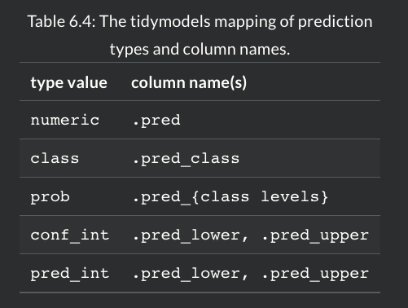

```{r setup, include=FALSE, message=FALSE, warning=FALSE}
if (requireNamespace("thematic")) 
  thematic::thematic_rmd(font = "auto")
```


          
      
# Modeling Basics

Our modeling goal is to predict the sale price of a house based on other information we have, such as its characteristics and location. The dataset is from Ames Housing data. 
```{r, warning=FALSE, message=FALSE}

library(tidyverse)
library(modeldata)
data(ames)
head(ames)
```


## Exploring Features

Step 1 is exploratory data analysis. Outcome we want to predict is sale price 

```{r, warning=FALSE, message=FALSE}
library(tidymodels)
tidymodels_prefer() # handles conflicting pkgs 

ggplot(
  ames,
  aes(x= Sale_Price)
)+
  geom_histogram(bins = 60, fill='2', color=3)+
  scale_x_continuous(labels = scales::dollar_format())
```


The plot is right skewed, more homes under $400,000.

```{r}
min(ames$Sale_Price)
median(ames$Sale_Price)
mean(ames$Sale_Price)
```

It is wise to `log()` transform the data as to ensure our data avoids negative side effects of predictions and makes a robust inference possible.

```{r}
ggplot(
  ames,
  aes(x= Sale_Price)
)+
  geom_histogram(bins = 50, fill='2', color=3)+
  scale_x_continuous(labels = scales::dollar_format())+
  scale_x_log10()
```

The units of the model coefficients might be more difficult to interpret, as will measures of performance.  If the sale price is on the log scale, these differences (i.e., the residuals) are also on the log scale. It can be difficult to understand the quality of a model whose RMSE is 0.15 on such a log scale.

Sale prices for this data will be set to log
```{r}
ames = ames %>% 
  mutate(Sale_Price = log10(Sale_Price))
```


## Data budget 

A data budget is the amount of data available for various model creation (parameter estimation, selection, tuning, performance assessment). *How should the data be applied to achieve different tasks?*

- allocate specific subset of data (instead of all data for 1 task)
  - if lots of data and predictors, use subset on determining which predictors are informative before full parameter estimation


### Train/ Test split - 1

The primary approach for empirical model validation is to split the existing pool of data into two distinct sets, the training set and the test set. 

- training set is majority of data. It is used to do most of the work to develop the model
- test set, held in reserve until 1 or 2 models have been selected to succeed. look at this test set 1x only! 

80% training / 20% test. use the `rsample::initial_split()`

```{r, message=FALSE, warning=FALSE}
library(tidymodels)
tidymodels_prefer() # conflict resolution 

# set seed for reproducibility
set.seed(501)

# 80/20 split
ames_split = rsample::initial_split(ames, prop = 0.80)
ames_split

# --- output
# training / test / original sample size
```


### Train/ Test split - 2

specifically label what is training and what is test data
```{r}
ames_train80 = rsample::training(ames_split)
ames_test20 = rsample::testing(ames_split)

# show the dimensions (rows, columns)
dim(ames_train80)
```

### Train/ Test split - 3

**Classification problem**, when there is a dramatic class imbalance in classification problems, one class occurs much less frequently than another. To avoid this, stratified sampling can be used. The training/test split is conducted separately within each class and then these subsamples are combined into the overall training and test set. 

With the housing data, the histogram is skewed showing more homes less tan $400,000 and splitting the data could reduce the number of more expensive homes in the model (poor modeling). 

```{r}
set.seed(502)

ames_split = rsample::initial_split(ames, prop = 0.80, strata = Sale_Price)

# train/test
ames_train80 = rsample::training(ames_split)
ames_test20 = rsample::testing(ames_split)

# dimensions (rows, columns)
dim(ames_train80)
```


If working with times series data, use the `rsample::initial_time_split()` with strata 


### Multilevel data

This dataset each house is an independent event, other data modeling will be different. Data splitting should occur at the independent experimental unit level of the data. 


# Fitting models - parsnip

Learn how to `fit()` and `predict()` with parsnip object

## 1 - create model

If linear regression model is goal, a variety of methods can be used to estimate the model parameters:

- ordinary linear regression using least squares
- regularized linear regression which adds penalty of least squares to shrink coefficients towards zero
- `model = lm(formula, data= )`
- a Bayesian model with regularization: `model = stan_glm(formula, data= , family= "gausian")`
- non-Bayesian regularized regression: `model = glmnet(x= matrix, y= vector, family="gausian")`

Each model takes in different formatted data, but with TIDYMODELS the selection of model is made simpler.

1. specify type of model based on its math structure (linear regression, random forest, KNN etc)
2. specify the engine for fitting the model (Stan or glmnet, etc)
3. declare the mode of the model (when required), prediction outcome type:
  - numeric => regression
  - qualitative => classification
  - if model can only predict, linear regression is already set
  
  
Model estimation can be done with `fit() or fit_xy()`, the `translate()` from parsnip converts the code into the package's syntax
  
```{r, message=FALSE, warning=FALSE}
library(tidymodels)
tidymodels_prefer()

# linear regression model:
# set engine as ( linear model | glmnet | stan )

parsnip::linear_reg(penalty = 1 ) %>%  # amt of regularization
  parsnip::set_engine("lm") %>% 
  parsnip::translate()

# missing_arg() is placeholder for data to be provided
```


## 1.1 - model fit 

Predict sale price of houses from data only from longitude and latitude data

```{r}
# - 1
lm_model = parsnip::linear_reg() %>% 
  parsnip::set_engine('lm')

# - 2
lm_form_fit = lm_model %>% 
  # use the log sales prices data
  parsnip::fit(Sale_Price ~ Longitude + Latitude, data = ames_train80 )

# - 3
lm_xy_fit = lm_model %>% 
  parsnip::fit_xy(
    x = ames_train80 %>% select(Longitude, Latitude),
    y = ames_train80 %>% pull(Sale_Price)
  )
```

Output
```{r}
lm_form_fit  # the main model 

# lm_xy_fit
```


## 1.2 - model results

Once the model is created and fit, we can use the results in a variety of ways; we might want to plot, print, or otherwise examine the model output. To get this data use `extract_fit_engine()`, then normal methods can be applied to this object.


```{r}
lm_form_fit %>% 
  parsnip::extract_fit_engine() %>% 
  # variance covariance matrix
  vcov()
```

See the model results with {broom} tidy() function
```{r}
tidy(lm_form_fit)
```


## 1.3 - predictions

Predictions using parsnip pkg is that results are always tibble dataframes, column names are always predictable, rows match input dataset.

WARNING: use `predict(lm_form_fit)` NOT *predict(lm_form_fit$fit)* when data has been pre-processed



```{r}
ames_small_test = ames_test20 %>% slice(1:5)

# predict(lm_form_fit, new_data = ames_small_test)

ames_small_test %>% 
  select(Sale_Price) %>% 
  # bin cols 1
  bind_cols(predict(lm_form_fit, ames_small_test)) %>% 
  # bind cols 2
  bind_cols( predict(lm_form_fit, 
                     ames_small_test, 
                     type = 'pred_int') # 95% prediction interval
             )
```


### Decision Tree process

A demo of making a decision tree with parsnip

```{r}
# - 1
tree_model = decision_tree(min_n = 2) %>% 
  set_engine('rpart') %>% 
  set_mode('regression')

# - 2
tree_fit = tree_model %>% 
  fit(Sale_Price ~ Longitude + Latitude, data= ames_train80 )

# - 3
ames_small_test %>% 
  select(Sale_Price) %>% 
  bind_cols( predict(tree_fit, ames_small_test))
```

..


