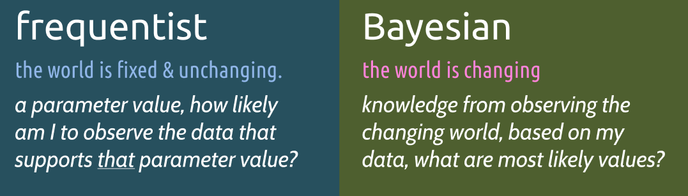

The source of learning material is **Data Analysis in R** eBook.

```{r setup, include=FALSE}
knitr::opts_chunk$set(echo = TRUE)
if (requireNamespace("thematic")) 
  thematic::thematic_rmd(font = "auto")
```


# Models & Estimation

Models are description of the system, process, or relationship you are trying to evaluate. If you have an accurate model for your system, then you will have a better idea of the quality of your data, the inference of your parameters, and generally get much farther in your analysis. 

response  <= (model or relationship being tested or confirmed) + stochastic


**stochastic** = randomly determined, random error or deviations 
from the relationship that are unexplained by the model


Example: data regarding rainfall and plant growth.

- response is $y$ plant growth
- data determines rainfall $x$ 
- hypothesis = increase in rainfall results in increase plant growth
- factors = sunlight, temperature etc.  
- factors and unknowns => random error (stochastic)

Simple Linear Regression: 
as x increase = change in y (constant across all values of x) 

findings:  increase in rainfall results in a small increase in plant growth
which estimates a parameter {coefficient}


## Model Complexity 

We want a model to be general enough that it contains truths and can be applied elsewhere, but not so general that it does not advance our understanding of the system.

models that are too general = underparameterized 

models that are too complex = overparameterized

important to consider what the goal of model selection is

- predicting unobserved information? 
- goal is understanding relationships within the data you’ve already collected ?


## Estimation

Estimation is how we use our model, or how we allow the parameters to be 
figured out. three common estimation types:

1. least used **Monte Carlo** estimation (`bootstrapping` or resampling), uses observed data repeatedly to draw inferences

2. most common, "Fisherian estimation" Frequentist estimation assumes a parametric distribution and is interested in the long run of frequencies within the data. 

3. **Bayesian** estimation, Bayesian inference is also assume a parametric distribution. Bayesian estimation includes a prior distribution or prior knowledge about the parameter.


*most important recommendation is to report your estimation type in sufficient detail*


### Process

null hypothesis = no difference from what occurs in nature

1. collect data
2. develop test statistic
3. randomize data and generate large number of test statistics from randomized data
4. randomized test stats create null distribution
5. compare to observed test stats


 **Frequentist** approaches asks: “What is the probability of the data that I observed compared to a fixed and unknowable parameter(s).”
 
paradigm:
 
1. Assume that data are repeatable random variables.
2. Assume that parameters do not change (fixed and unknowable)
3. All experiments are considered to be independent
4. accept or reject hypotheses and outcomes
5. *p-values* are a key outcome


**Bayesian** approach asks “What is the probability of certain parameter values based on the data I observed.”

paradigm:

1. Assume that the data are fixed
2. Adopt a degree-of-belief from probability
3. *Can update beliefs* in the sense that prior information can be used to directly inform the estimate of certain parameters
4. Bayesian estimation is driven by distributions and uncertainty
5. Outcomes are not required to accept or reject anything based on a critical value





The problem with *p-values* 

- often hard to explain 
- p-value does not indicate result is correct or not
- does not provide the magnitude of an effect


### Estimation mechanics

**Frequentist**s use maximum likelihood estimation (MLE), max the log function by minimizing the negative log likelihood 

**Bayesian** uses Bayes rule, a term for posterior distribution, likelihood, prior distribution and normalizing constant

Posterior (outcome) = likelihood * prior / normalizing * constant


# Linear Model 

statistical model vs statistical estimation

## Terms

- units – observations or data points, often indexed with *i*
- $x$ variable = predictors or independent variable
- $y$ variable = outcome, response or dependent variable 
- inputs (model terms) inputs == predictors but predictors are indep. variables
- residual error = the final term of model equation (the unexplained)
- multiple regression is more than 1 predictor (multivariate regression/ MANOVA/ PCA)


## Components

Linear model :

- response = deterministic + stochastic 
- outcome = linear predictor + error
- result = systematic + chance

`lm( y ~ x)` the error term is estimated but not specified

 It is critical that we understand how our (response) data were generated and sampled, in order to best inform our decision about an associated distribution.
 
 1. distributions: normal, binomial. Bernoulli, Poisson and beta, etc
 2. how data was sampled: 
    - if data observations were success/fail then you are working with a Bernoulli distribution
    - if data represents counts >= 0 integers then Poisson distribution
3. data characteristics: what the data looks like
4. run a model & explore distributions
5. no perfect answer: *The goal is always to get to that one, clear distribution that makes sense and is defensible*


Linear component, doesn't always mean straight line (GLMs), predictors can be continuous or categorical. 

- Continuous => regression. 
- Categorical => ANOVA. 
- Continuous & Categorical => ANCOVA (analysis of co-variance)
- design matrix helps understand how the model works, tells you if an effect is present and by how much. use `model.matrix()`


**Parameterization** effect is the intercept estimate is always the mean of group 1, 
but also the baseline estimate that other groups needs to be combined with 


### Distributions

most common ones

1. Normal distribution 

  - for continuous data
  - negative infinity to positive infinity
  - impacted by central limit theorem
  - parameters: mean and variance

2. Binomial distribution

  - discrete integer data (successes out of trial)
  - parameters: p success probability and N sample size
  - Bernoulli distribution N= 1 (coin flip = heads or tails)

3. Poisson distribution

  - counts >= 0 to infinity
  - parameter: mean, variance
  - approx to Binomial when N is large, p is small
  - approx to Normal when lambda is large


### Linear Model - 1

Fake dataset about fish, length is response variable y and other variables are predictors. 

```{r, warning=FALSE, message=FALSE}
library(tidyverse)
fish_df = tibble(
  weight = c(16,18,15,27,29,31),
  stream = factor(c(1,1,2,2,3,3)), # c(1,1,2,2,3,3),
  watershed = factor(c(1,1,1,2,2,2)), # c(1,1,1,2,2,2), 
  habitat = c(1,2,3,1,2,3), #factor(c(1,2,3,1,2,3)),
  length =  c(41,46,37,52,54,60)
)

lm(fish_df$length ~ 1)  # same as mean(length) but in the model compares columns
m= fish_df$length ~ 1
model.matrix(m)
```


### T-test (ANOVA)

Compare 2 groups for lengths = ANOVA test.

```{r}
#                     intercept 1
lm(fish_df$length ~ fish_df$watershed)
```
The mean of `watershed2` is 14 but not found in data, it needs to be added to the estimate of the 1st `watershed` group, thus `41.33 + 14 = 53.33` is the mean length of fish in `watershed2`. *Think of the intercept as a control group, the other columns are the difference between the controls.*


```{r}
# means parameterization 
lm(fish_df$length ~ fish_df$watershed -1)
```

```{r}

model.matrix(fish_df$length ~ fish_df$watershed -1)
```


# Simple Linear Regression

The scatterplot with line of best fit, no categorical data, x changes so does y.
As seen the formula is `lm(length ~ weight)`.


```{r}
lm(fish_df$length ~ fish_df$weight)
```

The fish weight estimate of 1.167 (slope coefficient). For every 1 unit increase in weight the fish length increases by 1.167. [fish length increases 1.167 for every 1 unit in weight].


# Pre-fitting your model

The pre and post fitting of models are a backandforth activity. 

- data transformation, get the data to better fit for a model, such as `log()` values for constraining clustered or skewed data for estimation, or **mean-centering** where you subtract the mean of all observations which centers the data at 0. Avoid test of normality such as Shapiro-Wilk test, Anderson-Darling test etc as they are very conservative and state that data is not normally distributed.

- correlated predictors, ensure predictors are not too correlated => poor coefficient estimates. Correlations closer to 1 mean the 2 variables are highly predictive of each other. There is no set threshold for correlations but `0.6-0.7` should get your attention, below `0.6` is fine. Use the `cor(matrix.object)` for correlation values


# Post-fitting your model

Evaluate the model with the summary function

```{r}
set.seed(15)

n <- 15 # Number of observations
a <- 0 # Intercept
b <- 1.5 # Slope
sigma2 <- 25 # Residual variance
x <- 1:15 # Values of covariate 

eps <-rnorm(n, mean=0, sd=sqrt(sigma2))
y <- a + b*x + eps

model = lm(y ~ x)
summary(model)
```

## Model Summary


- **residuals** = distance from each observation is from the fitted model. Residuals are normally distributed around 0, if not it shows model is over or under predicting too many points. Want median residual ~0, and min and max to be the same

- **coefficients** = parameter estimates

- **significance codes** = the p-values, first select a significance threshold such as alpha = 0.05

- **residual standard error** = the standard deviation (spread) of residuals

- **multiple R-squared** = the % of variance explained by the model, a common model metric, higher values = 'better' but increases with additional model terms

- **adjusted R-squared** = the % of variance explained by the model djusted for more model terms 

- **F-statistic** = tests the null hypothesis that all model coefficients are 0. F-stats are reported for ANOVA models.


```{r}
# plot(model)

# residuals.lm(model) == resid(model)
res = residuals.lm(model)

hist(res, breaks= 10, las= 1, border='black',col= 1, xlab="Residual")
```


### Notes

GOAL: looking for the model to have `homoscedasticity` (means residuals are approximately the same), we don't want patterns in the data == `heteroscedasticity`

For multiple comparisons using ANOVA comes with multiple tests (post hoc means tests) where you run the risk of false positives with increased thresholds. Use **Tukey's Honest Significant Difference** (HSD) test as it is common and versatile.

**ANCOVA** analysis of covariance,  can increase the power to detect differences by reducing the within group variances. It can often be evaluated early as diagnostic to understand the relationship between the continuous and categorical predictors, and the significance of the interaction term may determine how you proceed.

- if the interaction is not significant => remove it


# ANOVA 

Analysis of variance is used for categorical data, but can include continuous data.
ANOVA test are `1-way` and `2-way` which means how many factors are being exminded
in the model. A **factor** is the categorical variables you are evaluating (levels or groups). 

The analysis of variance being checked is 

- *between-group* variance = comparing the mean of each group with overall mean of the data (individual points don't matter)
- *within-group* variance = variation of each data point observation from its group mean

sum of squares is used to quantify them, this metric in ratio is the **F-statistic** which combines degrees of freedom and p-value

- small p-values come from large F-statistics
- large F-statistics suggest that the between group variance `>` than the within-group variance. 


## anova - 1

Basic categorical dataset, example dataset of fish, question of whether the mean maximum fish size differs among populations.

```{r}
fish.df = tibble(
  size = c(3,4,5,6,4,5,6,7,7,8,9,10),
  pop = c( rep("A",4), rep("B",4), rep("C",4))
)

fish.df %>% 
  ggplot( aes( x= pop, y= size)) + 
  geom_boxplot()+ 
  geom_jitter()

```

ANOVA model will answer the question whether any group means differ from another. 
It only tells us if one or more group(s) differ from another — *it will not tell us which groups differ*. 


## anova - 2 (lm)

```{r}
lm.model = lm(size ~ pop, data = fish.df)
summary(lm.model)
```

So in the example above popA has a mean maximum size of 4.5, while the mean maximum size of popB is 5.5, the combination of 4.5 and 1.

The associated p-value can help provide a significance interpretation on the F-statistic. That is, a p-value < 0.05 tells us that at least one group mean differs from another at the α = 0.05 level of significance. 

- ANOVA p-value > 0.05  == no group means differ from each other
- ANOVA p-value < 0.05 == 1+ group mean differs from others


## anova - 3 (aov)

the preferred way to do AOV is the `aov()` function. Categorical variables need to be factors, ensure factors by `as.factor()`

```{r}
aov.model = aov(size ~ pop, data = fish.df)
summary(aov.model)

aov.model$coefficients
```


## anova - 4 (Tukey HSD)

Multiple comparisons ANOVA, helps us quantify the differences between groups in order to determine which groups significantly differ from each other. Use the Tukey's HSD test (many others can be used), after you run a `aov()` test. 

The Tukey HSD procedure will run a pairwise comparison of all possible combinations of groups and test these pairs for significant differences between their means, all while adjusting the p-value to a higher threshold for significance in order to compensate for the fact that many statistical tests are being performed and the chance for a false positive increases with increasing numbers of tests.

```{r}
tukey = TukeyHSD(aov.model, conf.level = 0.95)
tukey
```

### Summary

- `diff` column provides an estimate of the mean difference between the groups
- `lwr` and `upr` columns give us the lower and upper bound of the confidence interval on the difference.

Confidence Interval :

- If the `confidence interval overlaps 0 == a non-significant comparison` (i.e., the difference is not significantly different from 0)

- if the confidence interval does not overlap 0 == have evidence for a significant difference between groups.


```{r}
plot(tukey)
```


# General Linear Models (GLM)

Generalized linear model is just a linear model, but with a modified error distribution that better captures the data generating process that has helped in the creation of your data.

The arguments are `family` set to `poisson` or `binomial` etc.


## Poisson linear regression

Poisson distribution is a distribution of values that are zero or greater and integers only. Example is count observations, always positive, the 1 parameter is $\lambda$ lambda which is both mean and variance.

Using the fishing data in the COUNT library, let’s model the relationship between total abundance (totabund) and mean depth (meandepth). Total abundance are counts, and we might hypothesize that abundances of fishes decreases with increasing depth.

```{r}
library(COUNT)
data(fishing)

ggplot(
  fishing,
  aes(x= fishing$meandepth, y= fishing$totabund)
) +
  geom_point()

```


## Poisson GLM

```{r}
pois.glm = glm(fishing$totabund ~ fishing$meandepth, 
               data = fishing, 
               family = poisson
               )
summary(pois.glm)

```


# Poisson Regression -- dataquest

Poisson Regression models are best used for modeling events where the outcomes are counts. Or, more specifically, count data: discrete data with non-negative integer values that count something. Either as counts or ratios.

Poisson Regression helps us analyze both count data and rate data by allowing us to determine which explanatory variables (X values) have an effect on a given response variable (Y value, the count or a rate). 

$\lambda$ lambda or is $\mu$ (mu) is the average number of times an event may occur per unit of exposure (**parameter** of Poisson distribution). Exposure can be times, space, distance etc, $t$. 

Poisson Distribution is most commonly used to find the probability of events occurring within a given time interval. 

- `dpois(sequence,lambda)` to plot the Probability Density Functions (PDF) in our Poisson distribution. 

## Example

If there are 12 cars crossing a bridge per minute on average, what is the probability of having seventeen or more cars crossing the bridge in any given minute?

`ppois(q, u, lower.tail=T)` provides the probability that a random variable will be lower or equal to a value, set it to false to find `q` >16.

```{r}
p = ppois(q= 16, lambda = 12, lower.tail = F)

glue("there is {floor(p*100)}% probability")
```

# Poisson Regression & GLM

Generalized Linear Models are models in which response variables follow a distribution other than the normal distribution.


